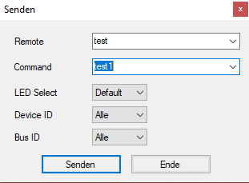

# ATGL - LAB Protokoll | Düzgün, Li und Wimmer

## Use Case - Sandra | Küche

### Aufgabenstellung
Es soll für die Klientin Sandra entsprechend der Angaben eine Lösung erarbeitet werden wodurch Sie ihren Alltag leichter bestreiten kann. Dazu haben wir mit AsTeRICS Grid, einige Bedienoberflächen kreiert und konfiguriert, dadurch wird eine Bedienung der Geräte ermöglicht. Darüber hinaus kann sie auch Spiele spielen. Die Eingabegeräte (FlipMouse & Fabi) wurden entsprechend ihrer Einschränkungen angepasst.

### Klientin Kurzbeschreibung
Die Klientin Sandra möchte sich ihren körperlichen Einschränkungen mit Hilfe der modernen Technologie, die wir zur Verfügung haben, widersetzen. Da sie abgesehen von ihren physischen Barrieren, auch eine signifikante Sehschwäche hat, ist die Klientin in ihrer Selbstständigkeit stark limitiert. Das Ziel ist es, ihr eine gewisse Autonomie zurückzugewinnen.  

 

Frau Sandra besitzt bereits einen Rollstuhl, einen Laptop und ein Smartphone. Da sie Buchstaben nur stark vergrößert wahrnehmen kann (binocular acuity of distant vision: b21000), müssen digitale Geräte auch dementsprechend konfiguriert werden. Außerdem sollte man ihre Protanopie (colour vision: b21021) und die Notwendigkeit nach hohem Kontrast (contrast sensitivity: b21022), in Betracht ziehen.  

 

Dass sie dennoch über gewisse körperliche Funktionen verfügt, ermöglicht einen größeren Spielraum bei der Verwendung von Hilfsmittel. Abgesehen davon, dass sie ihren Kopf bewegen kann, sind auch Daumen und Zeigefinger am linken Arm vollkommen funktionstüchtig. Die Tatsache, dass sie ihren Mund bzw. ihre Lippen bewegen kann, ermöglicht die Verwendung einer Flip Mouse.  

 

Die Klientin Sandra wünscht sich, Licht, Temperatur, Jalousien und etliche Elektrogeräte wie Fernseher, Musikanlage und ihre Spielzeuge, selbstständig steuern zu können. Außerdem möchte sie den Computer insofern steuern können, sodass sie im Internet surfen und E-Mails schreiben bzw. auf diese antworten kann. Zusätzlich würde sie gerne Klänge erzeugen, Computerspiele adaptieren und visuell mit Hilfe von Phillips Hue Go oder Infrarot Lampen kreieren. Als letzten Wunsch formulierte sie, ihr Smartphone für kommunikative Funktionen wie Anrufe tätigen und SMS schreiben, ohne jegliche Hilfe verwenden zu wollen.

## AsTeRICs Grid
### Raumauswahl Grid - Main Grid

Das Hauptmenü umfasst eine Auswahl der 3 verschiedenen Räume. Es werden Raumspezifische und sogenannte "Sharing Grid's" verwendet. Die Sharing Grid's sind für alle Räume gleich und wurden für eine leichtere Anpassung und wieder Erkennbarkeit speziell als solche gestaltet. 

### Main Grid Küche

Dies ist das eigentliche Küchen Grid, man kann Licht allgemein ein/ausschalten (Esstisch & Arbeitslicht) zudem kann man über eine weitere Schaltfläche in ein Untermenü navigieren, um das Deckenlicht zu dimmen. Um die Temperatur einzustellen, öffnet sich wiederum ein neues Grid. Im Grid Beamer kann der Beamer im Wohnzimmer gesteuert werden. Die Jalousien werden nach Klick auf "Jalousie HOCH" / "Jalousie RUNTER" vollständig herunter bzw. hinauf gefahren, mit dem Befehl "Jalousien STOP" bleiben diese an der aktuellen Position stehen. Zudem verfügt das Grid über ein Radio Untergrid.  

### Sharing Grid - Temperatursteuerung

Im Temperaturgrid kann zwischen 3 Temperaturen 20°C, 22°C und 24°C gewählt werden. Weitere befehle erlauben es die Heizung EIN oder AUS zuschalten. Aufgrund der Heizungskonfiguration wird hier lediglich die Absenkung Ein bzw. Aus geschalten um eine weitere Möglichkeit komfortabel Energiesparen zu sparen auf ein für Sandra angepasstes Temperaturniveau gibt es zusätzlich den Button "Energie Sparen"

### Sharing Grid - Lichtdimmen

Die Lichtsteuerung ist für Wohn-, Schlaf- und Küchenbereich in einem Grid zusammengefasst. Es können hier die jeweiligen Lampen ein/aus geschaltet werden, sowie für Wohn und Schlafzimmer die Lichter auf 35% und 65% gedimmt werden.

### Beamersteuerung - Küche

Im Beamer Grid kann wie bereits erwähnt der Beamer im Wohnzimmer gesteuert werden. Es besteht die Möglichkeit den Beamer Ein & Aus zuschalten sowie die verwendete Quelle auf HDMI2 zu wechseln. (Verwendeter Eingang)

### Sharing Grid - WEB-Radio

Das Radio Grid erlaubt es verschiedene voreingestellte Radiosender auszuwählen ( Ö1, Ö3, 88.6, FM4, Radio Wien). Das Radio kann zudem ein/aus geschalten werden und die lautstärke erhöht/verringert werden. Es kann auch manuell zwischen Radiosendern gewechselt werden.

## Ein-/ Ausgabegeräte
Als zusätzliche Eingabegeräte wurden die FlipMouse und das Fabi verwendet. Diese wurden entsprechend konfiguriert

### FABI - Eingabegerät 1

Am Fabi wurden 2 Taster angeschlossen welche im WEB - Interface als Pfeil "links" und "rechts konfiguriert. Dadurch konnte Sandra das Spiel "HillClimbRacer" spielen.

Konfiguration von Taster 2 im WEB - Interface als Pfeil "Rechts" Dadurch kann Sandra beim Spiel "Hill Climb Racer" Gas geben.

Konfiguration von Taster 1 im WEB - Interface als Pfeil "Links" Dadurch kann Sandra beim Spiel "Hill Climb Racer" bremsen.

PC Spiel "Hill Climber" Startbildschirm

Beim spielen

https://user-images.githubusercontent.com/95447783/144845615-9a4815f1-15b3-4475-b079-d19f37f21ede.mp4

Kurzes Video beim spielen mit Fabi und den 2 Buttons via Fabi

### Flip Mouse - Eingabegerät 2

Konfiguration derFlip Mouse am WEB Interface für die Funktion als Maus

### Flip Mouse - Evaluierung

Ergebnis der Fitt's Law Softwarebasierten Evaluierung nach ISO 9241-9

### IR-Trans - Ausgabegerät

Der erste Schritt mit dem IR Trans war es die Applikation zu installieren und die IR zu starten.

Danach wurde zur ersten Probe ein IR Signal eingelesen und wieder ausgegeben.

Beim eingeben musste zuerst oben ein „remote name“ festgelegt werden und danach ein Signalname eingestellt werden. Beim ausgeben wurde die Fernbedienung ausgewählt und dazu das zugehörige Signal.

Um dies nun mit der ARE (Asterics runtime) zu verknüpfen musste zuerst der Funktionsblock eingestellt werden. Dazu wurde zunächst beim „hostname“ der „localhost“ eingestellt. Dann musste der PORT auf 21000 eingestellt werden. Beim schicken des Signals ist es dann sinnvoll beim „prestring “(Der Teil der vor jedem anderen Signal geschickt wird) den Namen der oben erstellten Fernbedienung zu nehmen und bei den „sends“ nur noch den Namen der Signale einzustellen. Aufpassen sollte man jedoch sehr, da bei einem Leerzeichen zu viel das Programm nicht mehr funktioniert. 

Um dies nun auszuführen kann man in der Asterics-Grid eine „Action“ einstellen. Dazu musste nur noch die Komponente ausgewählt werden und das Signal 1 geschickt werden.

## Accesibility (iOS)

Das iOS-Betriebssystem enthält Barrierefreiheitsfunktionen, von denen Sie in vielerlei Hinsicht profitieren können – körperliche Aktivität und motorische Fähigkeiten, Zuhören und Lernen sowie viele Interaktionen. Wir erklären Ihnen, wie Sie diese Funktionen konfigurieren und Shortcuts einrichten, um gezielt auf jede Funktion zuzugreifen.

### Farbkorrektur - Einstellungen
Eine Anleitung (Betriebssystem: MacOS) zur Farbkorrektur / Kontrasterhöhung entsprechend den Bedürfnissen der Klientin Sandra:

1. Unter Systemeinstellungen den Unterpunkt „Bedienungshilfen“ anklicken

2. „Anzeige“ im Unterreiter „Sehen“ anklicken und den Filtertyp auswählen, nachdem man den Navigationspunkt „Farbfilter“ ausgewählt hat

3. Kontrasteinstellungen unter dem Navigationspunkt „Display“ modifizieren.

(Auch die Kontrasteinstellungen wurden ihren Bedürfnissen gerecht gemacht, da sie wie in der Beschreibung bereits vermerkt, nur Texte und Bilder, die unter einem starken Kontrast stehen, warnehmen kann)

https://user-images.githubusercontent.com/95447783/145011435-095a7594-e634-46a9-83b1-e51f39a477a6.mp4

### Bildschirmlupe - Einstellungen

(Hier sieht man die Einstellungen, welche die Bildschirmlupe aktivieren. Die Bildschirmlupe folgt der Maus in einem angemessenen Tempo. Sie wird benötigt, um der Sehschwäche der Klientin entgegenzuwirken)

### Siri - Anwendung (Nachricht)

https://user-images.githubusercontent.com/95447783/145010899-61f14d02-ce41-41c3-a699-3b0ea9cd9658.mp4

### Siri - Anwendung (Anruf)

https://user-images.githubusercontent.com/95447783/145011288-497be48a-d371-412f-82ae-c16f9ab96462.mp4

## Der Aufbau

Rollstuhl mit den Anbauteilen, Flip Mouse, Fabi inkl. 2 Buttons und Laptop mit Tobii und Verkabelung.

Seitenansicht mit Blick auf die Halterung. Diese wurde am Rollstuhl mit einer Schraubklemme und beweglicher Arm befestigt.

Verwendung der Buttons und dem Fabi mit der Scanning Funktion am Grid

FlipMouse Befestigung und Verwendung der Buttuns vom Fabi

## Danksagung

An dieser Stelle möchte ich mich ausdrücklich bei Dieter Stifter für die tolle Zusammenarbeit und die Bereitstellung seines Laptops bedanken. Es wurden alle Ein- / Ausgabegeräte für alle 3 Gruppen gleichzeitig angeschlossen. Auch wenn bei der Befestigung mit Klebeband und Co improvisiert wurde 😁 hielt sein Laptop tapfer stand und es funktionierte alles wie erwartet 💪 

# Danke Dieter 🤟
